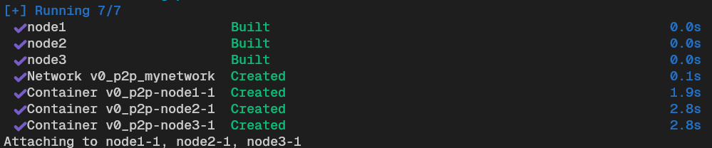

# BitcoinMesQueUnaBlockchain

## Introducció

Avui en dia la majoria dels diners són digitals, la funció més funamental d’un banc és mantenir i gestionar la base de dades dels comptes bancaris. Sobretot s’ha d’assegurar que una persona no pugui utilitzar diners que ja s’ha gastat. Això per ells es relativament fàcil ja que són els unics que tenen capacitat de modificar el llibre de comptabilitat.


Aquest sistema té certs inconvenients, com la subjecció a les seves normes, la possiblitat de censura, el potencial control i és vulnerable.

A continuació mirarem de distribuir aquest llibre de comptabilitat desde cero.

## Distribuïm el llibre de comptabilitat


Ara cada persona/node gestionarà el llibre de comptabilitat. Ara quan una persona vulgui gastar diners, ho comunicaran als altres, i els altres s'asseguraran que és una transacció vàlida.

### Format del llibre de comptabilitat

El llibre de comptabilitat serà un fitxer json on cada entrada sera una transacció. El format inicial d'una transacció serà aquesta:

```json
{
  "index": 1,
  "timestamp": "2025-04-14T10:00:00Z",
  "sender": "A",
  "receiver": "B",
  "amount": 10
}
```

- index: Posició de la transacció.
- timestamp: Quan s'ha creat.
- sender: Persona que envia.
- receiver: Persona que rep.
- amount: Quantitat que envia.

Per tant el llibre de comptabilitat amb 3 transaccions tindra aquest format:

```json
[
  {
    "index": 1,
    "timestamp": "2025-04-14T10:00:00Z",
    "sender": "A",
    "receiver": "B",
    "amount": 10
  },
  {
    "index": 2,
    "timestamp": "2025-04-14T10:05:00Z",
    "sender": "B",
    "receiver": "C",
    "amount": 5
  },
  {
    "index": 3,
    "timestamp": "2025-04-14T10:10:00Z",
    "sender": "A",
    "receiver": "C",
    "amount": 3
  }
]
```

### Comunicació

La comunicació mirarem de fer-la a través de una API sobre HTTP.

#### POST /version

Un node informa que es vol connectar.

```json
{
  "node_id": "A",
  "timestamp": "2025-04-14T17:00:00Z",
  "known_height": 3,
  "node_address": "http://localhost:5001"
}

```

#### POST /verack

Resposta al version. Simplement acceptem la connexió

```json
{
  "node_id": "A",
  "node_address": "http://localhost:5001"
}
```

#### GET /addr

Demanar les adreces d'altres nodes

```json
{
  "node_id": "A",
  "node_address": "http://localhost:5001"
}
```

#### POST /addr

Reposta amb la llista d'adreces conegudes:

```json
{
  "nodes": ["http://localhost:5001", "http://localhost:5002"]
}
```

#### POST /inventory

Té noves transacció

```json
{
  "indexes": [3, 4, 5],
  "node_address": "http://localhost:5001",
  "node_id": "A",
}
```

#### POST /getdata

El node demana les dades reals corresponents a un inventory.

```json
{
  "indexes": [3, 4, 5],
  "node_address": "http://localhost:5001",
  "node_id": "A",
}
```

#### POST /transactions

Resposta amb la transaccins

```json
[
  {
    "index": 3,
    "timestamp": "2025-04-14T10:10:00Z",
    "sender": "A",
    "receiver": "C",
    "amount": 3
  }
]
```

### Situació

D'aquesta forma ja tenim distribuit el llibre de comptabilitat. Però encara ens falta solucionar varies problematiques per tal de que sigui un sistema segur, veridic, confiable...

Per exemple en aquesta versio més simple de xarxa distribuida que hem creat com podem saber que realment les transaccions que es fan venen realitzades per el propietari d'aquelles monedes?

En la següent versio anirem a solucionar aquest problema amb criptorgrafia!

## Digital Signature

Ara farem servir criptografia asimètrica per garantir que només el propietari d’uns fons pot autoritzar-ne la transferència.

Claus

- Clau privada: el propietari mai comparteix.

- Clau pública: es deriva matemàticament de la privada i es pot revelar a tothom.

Signar un missatge

- Es calcula el hash del missatge (doble SHA‑256 de la transacció).

- Amb la clau privada es firma l'anterior hash, creant la signatura-

- La signatura i la clau pública s’afegeixen a la transacció.

Verificar

- Qualsevol node pot comprovar la signatura amb el mateix hash i la clau pública. Si la validació falla, la transacció és rebutjada.

### Format de la transacció

Hem afegit 2 camps al format de la transacció que ens permetran veure si és una transacció legitima creada pel propietari. I el sender i el receiver ara es una public key. Sempre el sender i la public_key haurien de ser el mateix.

```json
{
  "index": "1",
  "timestamp": "2025-04-14T10:00:00Z",
  "sender": "MEUCIQDg23....xYz",
  "receiver": "04bfc9...",
  "amount": 10,
  "signature": "32bfc9...",
  "public_key": "MEUCIQDg23....xYz"
}
```

## Blockchain

Fins ara guardàvem totes les transaccions en un únic fitxer ledger.json. A partir d'ara evolucionem cap a una cadena de blocs, cada bloc agrupa un subconjunt de transaccions i enllaça amb l’anterior mitjançant un hash.

### Estructura d'un bloc

```json
{
  "index": 0,
  "timestamp": "2025-05-05T12:00:00Z",
  "prev_hash": "0000000000000000000000000000000000000000000000000000000000000000",
  "transactions": [
    {
      "txid": "a3f2…",
      "sender": "MEUCIQDg23....xYz",
      "receiver": "MEUCIQDg23....xYz",
      "amount": 10,
      "signature": "MEUCIQDg23....xYz",
      "public_key": "04bfc9..."
    }
  ],
  "hash": "5fe2…"
}
```

Per tant ara el llibre de comptabilitat serà una llista de blocs encadenats, en comptes de una llista de transaccions. Ara els missatges /inventory i /getdata tant passaran blocs com transaccions.

/inventory

```json
{
  "type": "block",
  "hash": "5fe2…",
  "node_address": "http://localhost:5001",
  "node_id": "A",
}
```

#### POST /getdata

/getdata

```json
{
  "type": "tx",
  "hash": "a3f2…",
  "node_address": "http://localhost:5001",
  "node_id": "A",
}
```


## Proof of work i mineria

Ara far


## Com provar el codi

### Instal·lació prèvia

#### Docker

Per fer-ho cal tenir instal·lat **Docker desktop**, ja que instal·larà les depèndecies necessàries.

> [!NOTE]
> Cal tenir oberta l'aplicació per seguir endavant amb la prova

#### Python

Cal tenir instal·lades les llibreries a la variable d'ambient de python, es pot fer de la següent manera:

- `python.exe -m pip install --upgrade pip` (Actualitza l'instal·lador de paquets, si no ho està)

- `pip install datetime`

- `pip install flask`

- `pip install ecsda`

- `pip install requests`

### Escollir versió

Cal dirigir-se a un dels directoris depenent de la versió que es vulgui provar.

Cal executar la comanda per mouren's al directori, per exemple:
> `cd {camí del directori on es troba el codi baixat}/BitcoinMesQueUnaBlockchain`
> `cd /versions/v0_p2p`

### Aixecar contenidors

Per aixecar els contenidors i així crear de manera "artificial" aquests node, ho fem a partir del fitxer `docker-compose.yml`

Cal executar la següent comanda en una terminal que estigui en el directori de la versió.

> `docker-compose up --build`

Un cop executada, per configurar i veure els missatges de l'execucio per cada node, cal obrir 3 terminals en el mateix direcori i executar per cada terminal el següent:

> `docker logs -f "v0_p2p-node1-1"`



A cada terminal, s'ha d'executar la comanda anterior amb el corresponent nom de cada contenidor, en aquest cas, com es pot veure a l'imatge, seria "v0-p2p-node1-1", "v0-p2p-node2-1" i "v0-p2p-node3-1"

### Comprovar claus públiques

Abans d'iniciar les dades, es important revisar que el contingut dels fitxers "/tests/api_helper.py", contenen les public_key de cada node correctament, ja que estan hardcoded.

Per comprovar-ho, només cal mirar el log de cada node, hi allà apareix la public_key que cal copiar i modificar en el fitxer.

### Iniciar les dades

Per començar des de un punt inicial, tenim el fitxer `init_data.py` a cada versió, on crea un ledger i un utxos per cada node, estant buit i 10 monedes cada un, respectivament.

Per executar aquest fitxer, es tan fàcil, com:
> `python .\init_data.py`

> [!NOTE]
> Cal estar en el mateix directori de la versió escollida

### Executar testos

Aquests testos, permet provar les desavantatges i avantatges de cada versió i destacar-les per les següents.
Cal dirigir-se al directori `/tests`, i allà executar el tests desitjat.

Per executar es pot fer de la següent forma:
> python .\test1_controller.py

> [!NOTE]
> Recorda que cada cop que s'executi el test, el `ledger` i `utxos` canvia, i per tant, si es torna a aplicar un tests, els resultats poden ser no esperats.

> [!WARNING]
> Per reiniciar el joc de proves, cal tornar a reiniciar primer fent `python init_data.py` i després `docker-compose up --build`
